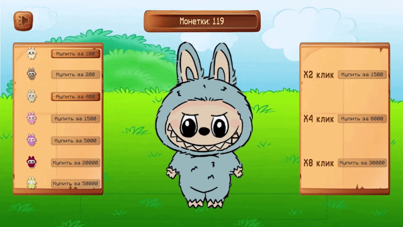
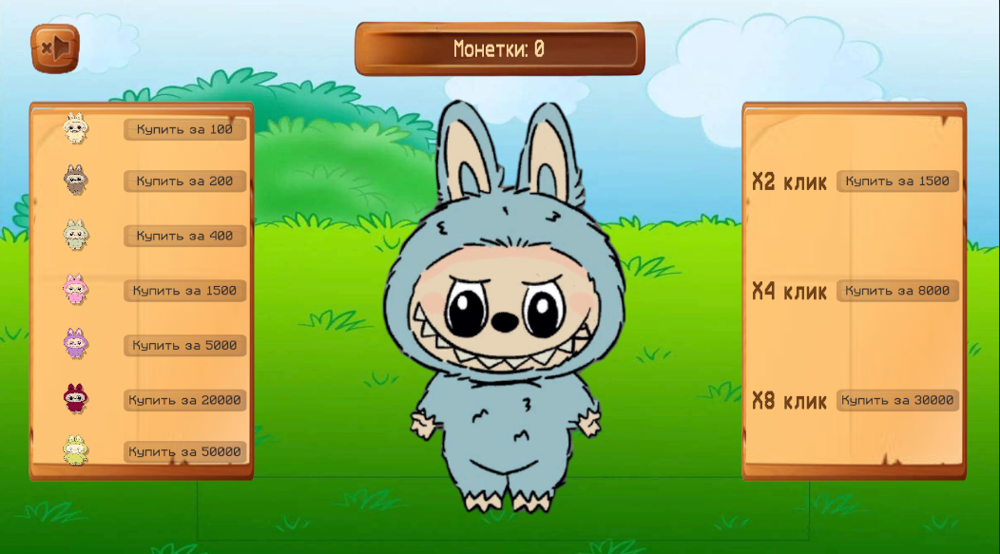
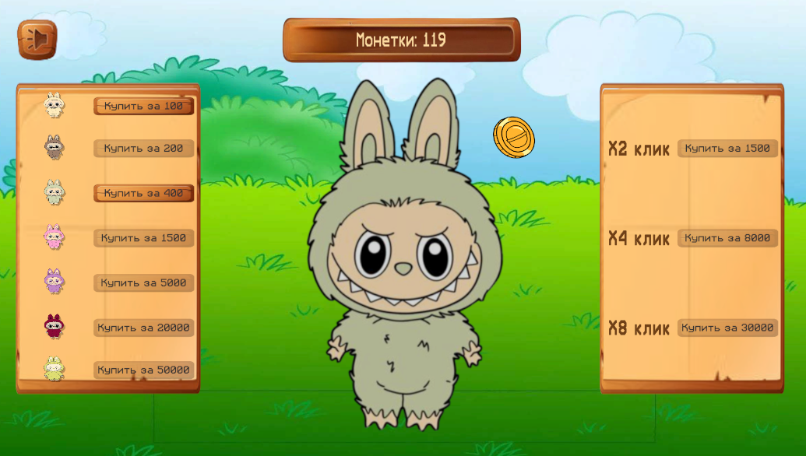

# Labubu Clicker

Simple clicker game made in Unity.

Click on Labubu to earn coins and unlock new colorful skins.

The more you click, the more coins you collect. Use them to customize your Labubu with different color variations and appearances.

---

## Gameplay Preview



---

## Screenshots

<p align="center">
  
  
</p>

---

## Gameplay Features

- Classic clicker gameplay
- Coin collecting system
- Unlockable Labubu skins
- Custom color variations
- Simple and relaxing gameplay
- Cute stylized visuals

## How to Play

1. Click on Labubu.
2. Earn coins.
3. Open the skin shop.
4. Buy new skins and recolors.
5. Customize your Labubu.

## Controls

- **Left Mouse Button** — Click on Labubu
- **UI Buttons** — Buy and select skins

## Built With

- Unity
- C#

## Project Structure

```text
Assets/
Packages/
ProjectSettings/
